# Integration example

## Camunda <-> UIPath

The project contains an example integration between Camunda SaaS and UIPath.  
It makes use of [Camundas UiPath Connector](https://docs.camunda.io/docs/next/components/connectors/out-of-the-box-connectors/uipath/) capabilities that come out-of-the-box.

### General integration architecture overview

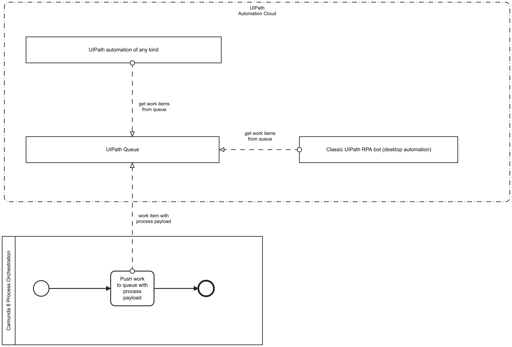

### 1. Prerequesites (steps before actual demo)

- [Camunda SaaS account](https://signup.camunda.com/accounts/)
- [Import/Upload](https://docs.camunda.io/docs/next/components/modeler/web-modeler/import-diagram/) the process model in the folder [process model](./process%20model)
- [Import/Upload](https://docs.camunda.io/docs/next/components/modeler/web-modeler/import-diagram/) the user task form in the folder [form](./form)
- [UiPath Automation cloud community account](https://cloud.uipath.com/portal_/register?subscriptionPlan=automationkit) (its free :) )
- [Create a queue](https://docs.uipath.com/orchestrator/automation-cloud/latest/user-guide/managing-queues-in-orchestrator#creating-a-queue) in the UiPath orchestrator called "_camunda_". The queue name in Camunda SaaS is accordingly defined in the "Configuration" section of the UiPath connector task "Create user in legacy system via RPA bot".
- Adjust Authorization related UiPath parameters in the connector details in Camunda SaaS 
    1. Select the task "_Create user in legacy system via RPA bot_" and adjust the properties in the sections "Authentication" and "Configuration" (UiPath organization, UiPath tenant, Organization unit ID)

- [Create the following secret](https://docs.camunda.io/docs/next/components/console/manage-clusters/manage-secrets/) in the Camunda SaaS cluster. The secret is referenced in the connector authorization configuration of the UiPath task
    - UIPATH-BEARER-TOKEN

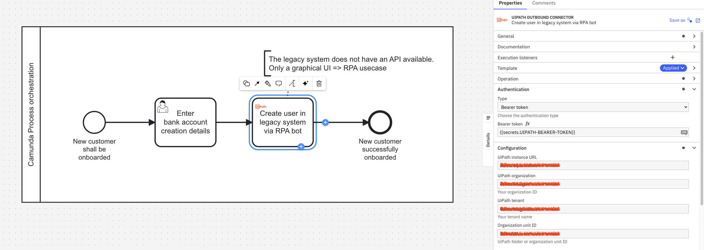


- Deploy the process model

- Open the UiPath Studio in the automation cloud
    - Create a new project without a template

- Add the following activities
    - UiPath.Core.Activities.ManualTrigger
    - UiPath.Core.Activities.GetQueueItems
    - UiPath.Core.Activities.ForEach
    - UiPath.Core.Activities.LogMessage

Complement the activities with the following control elements shown in the screenshot

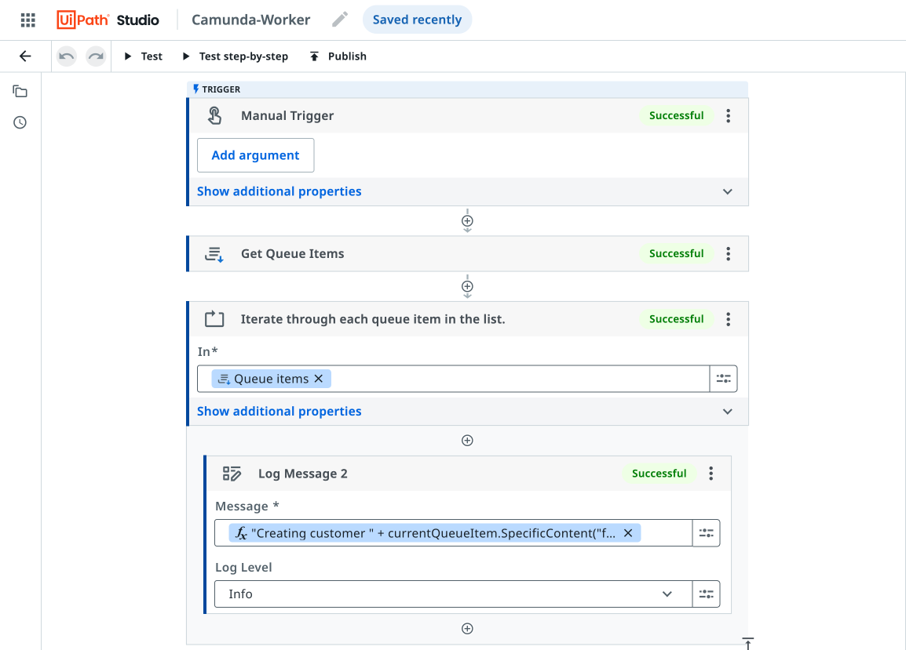

- Edit the log message to utilize the payload of the queue item coming from the Camunda process 

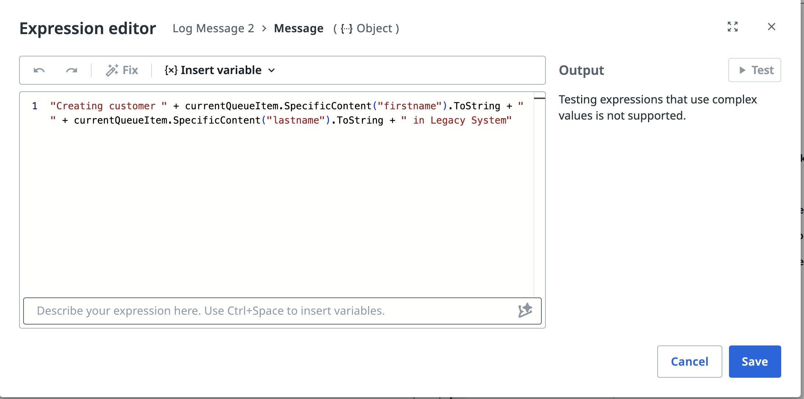

```
"Creating customer " + currentQueueItem.SpecificContent("firstname").ToString + "
" + currentQueueItem.SpecificContent("lastname").ToString + " in Legacy System"
```

- Instead of creating the UiPath automation manually, you can also import the UiPath automation file in the folder [uipath-worker-automation](./uipath-worker-automation%20model)

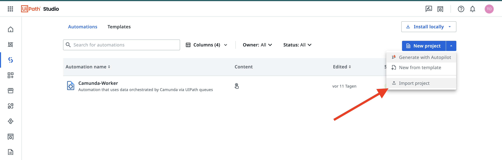


### 2. Demo flow

- Run a process instance without initial payload

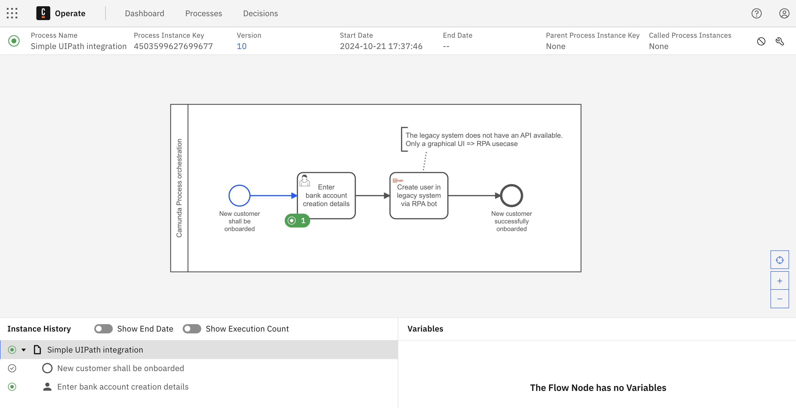


- Use the Camunda Tasklist to complete the form for the "Enter bank account creation details for onboarding" task
    - only "First name" and "Last name" are neccessary and will be utilized downstream

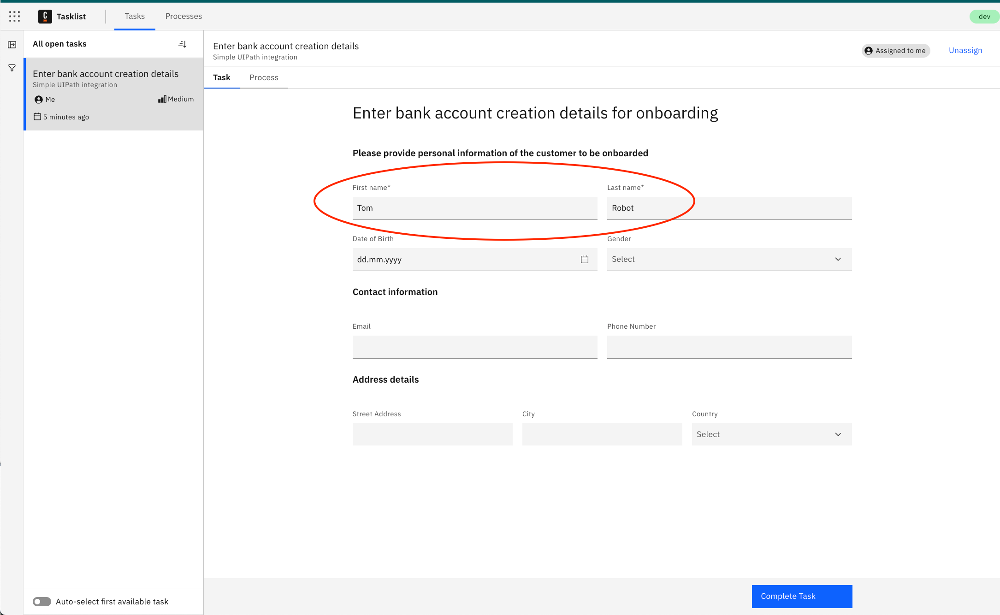

- After completion of the user task, check the queue transactions via the UiPath orchestrator

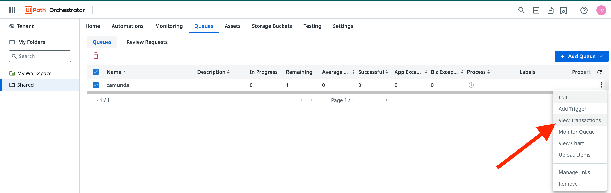

A new "Camunda item" should have been created.

- Check the details of the item 

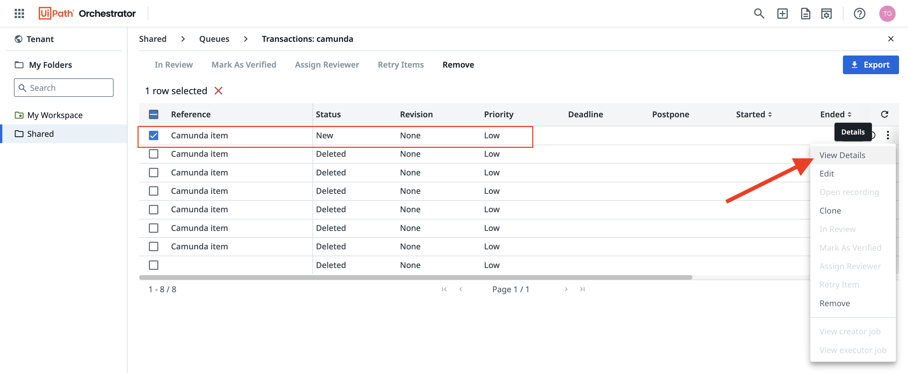

In the details view you should be able to see the process payload coming from Camunda


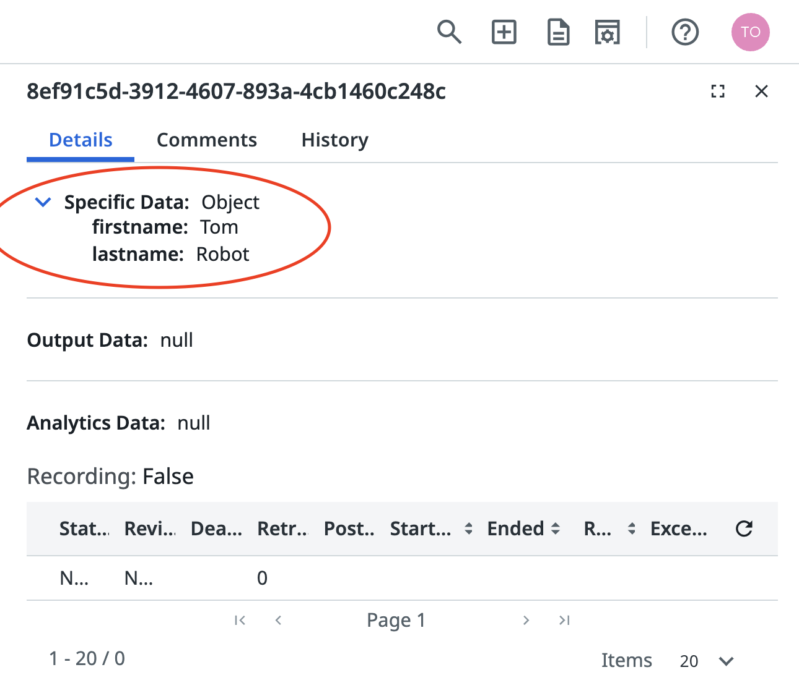


- Change to the UiPath Web Studio

- Open the created automation (see prerequistes above)

- Run the automation. Check the output section and verify that process payload from the queue item is being processed

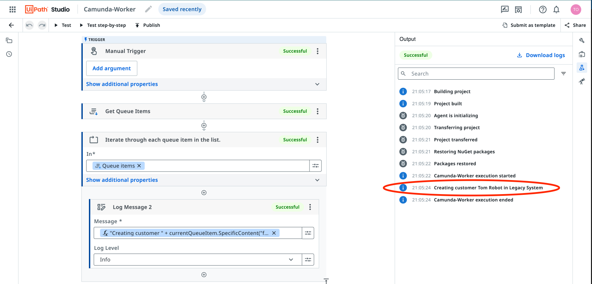